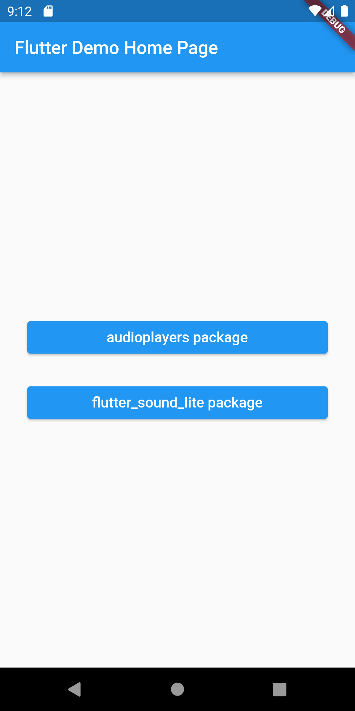
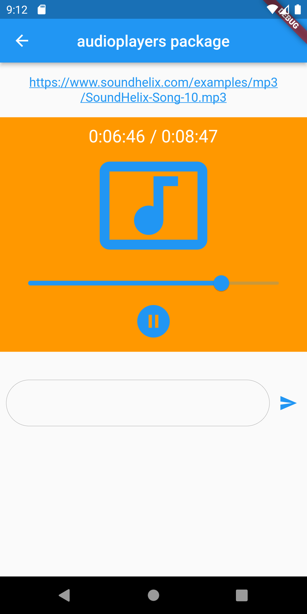
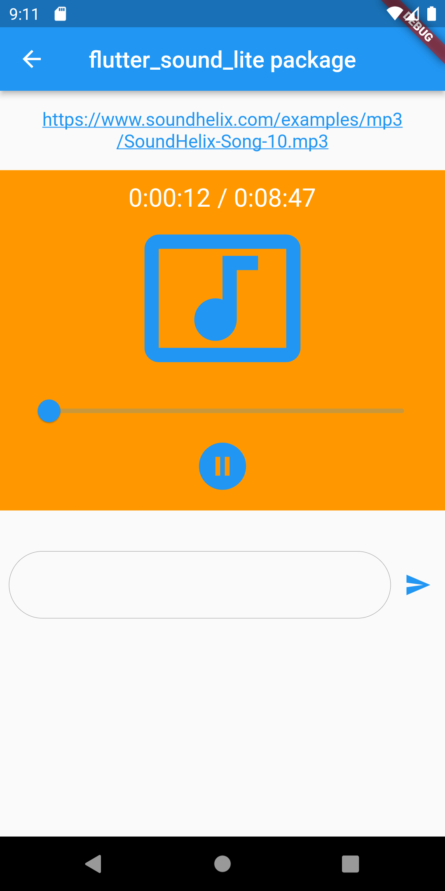

# Flutter Audio Players from URL with Both Via flutter_sound_lite & audioplayers packages

A new Flutter project.

## Important Settings for audioplayers package

on android/app/src/main/AndroidManifest.xml file

```
<manifest 
   <uses-permission android:name="android.permission.INTERNET" />
  <application 
      android:usesCleartextTraffic="true"
```

on android/build.gradle
```
  ext.kotlin_version = '1.6.10'
```

on android/app/build.gradle
```
   compileSdkVersion 31
   minSdkVersion 23
   targetSdkVersion 29
```


## IOS Settings


- FOR ->  Try replacing 'com.example' with your signing id in Xcode: open ios/Runner.xcworkspace ERROR
open XCode -> Project -> General -> Identity -> UPDATE BUNDLE IDENTIFIER ->  Remove example


- FOR -> Undefined symbol: ___gxx_personality_v0 ERROR
Use Solution -> https://github.com/Canardoux/flutter_sound/issues/666


## ScreenShots
- Home Screen



- audioplayers package



- flutter_sound_lite package



...happy hacking...
